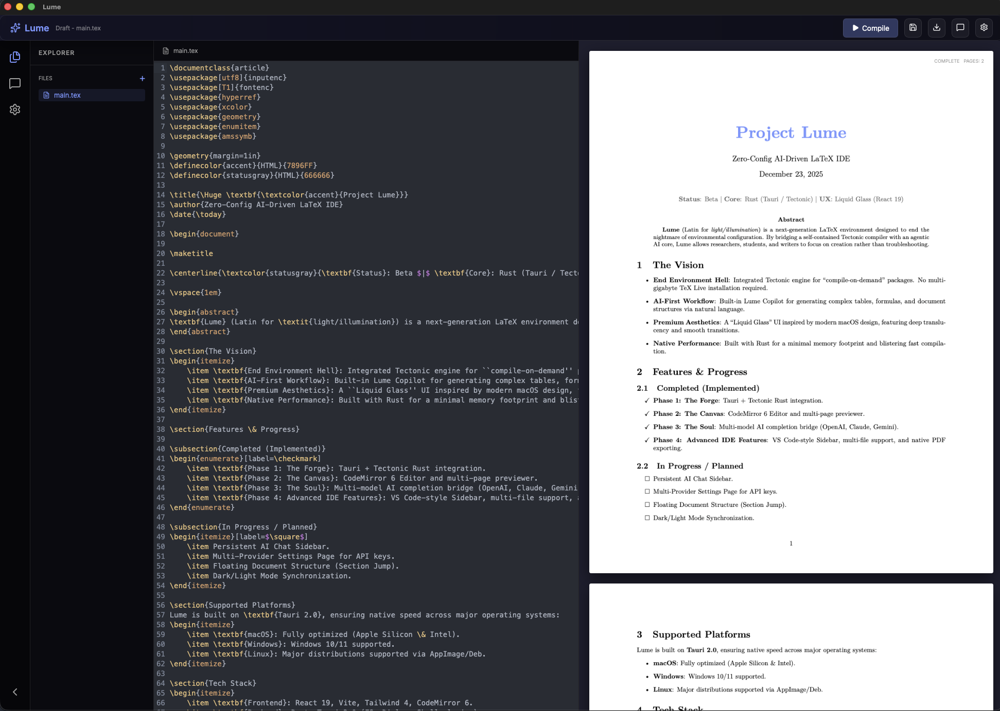

# Project Lume: Zero-Config AI-Driven LaTeX IDE

[](https://github.com/morrislin/lume/releases)

<p align="center">
  
</p>

> **Status**: Beta | **Core**: Rust (Tauri / Tectonic) | **UX**: Liquid Glass (React 19)

**Lume** (Latin for *light/illumination*) is a next-generation LaTeX environment designed to end the nightmare of environmental configuration. By merging a self-contained Tectonic compiler with an agentic AI core, Lume allows researchers, students, and writers to focus on creation rather than troubleshooting.

---

## 🚀 The Vision

- **End Environment Hell**: Integrated Tectonic engine for "compile-on-demand" packages. No multi-gigabyte TeX Live installation required.
- **AI-First Workflow**: Built-in Lume Copilot for generating complex tables, formulas, and document structures via natural language.
- **Premium Aesthetics**: A "Liquid Glass" UI inspired by modern macOS design, featuring deep translucency and smooth transitions.
- **Native Performance**: Built with Rust for a minimal memory footprint and blistering fast compilation.

---

## ✨ Features & Progress

### ✅ Completed (Implemented)
- [x] **Phase 1: The Forge (Compiler Prototype)**: Tauri + Tectonic Rust integration.
- [x] **Phase 2: The Canvas (Visuals)**: CodeMirror 6 Editor & Multi-page PDF.js Preview.
- [x] **Phase 3: The Soul (AI Core)**: Bridge for OpenAI, Claude, and Gemini completions.
- [x] **Phase 4: Advanced IDE Features**:
  - [x] VS Code-style Activity Bar & Sidebar.
  - [x] Multi-file Explorer (create and switch between `.tex` documents).
  - [x] Native PDF Export/Download with full OS permission integration.
  - [x] Atomic State Management for reliable file switching.

### 🛠 In Progress / Planned
- [ ] **Persistent AI Chat Sidebar**: Move AI interaction from a modal to a dedicated side panel.
- [ ] **Multi-Provider Settings**: Securely store and manage API keys (OpenAI, Anthropic, Google).
- [ ] **Floating Structure Tree**: Fast navigation via document sections/labels.
- [ ] **Dark/Light Mode Sync**: Adaptive Liquid Glass theme based on OS preferences.

---

## 💻 Supported Platforms

Lume is built on **Tauri 2.0**, ensuring native speed across major operating systems:
- **macOS**: Fully optimized (Apple Silicon & Intel).
- **Windows**: Windows 10/11 supported.
- **Linux**: Major distributions supported via AppImage/Deb.

---

## 🛠 Tech Stack

- **Frontend**: React 19, Vite, Tailwind 4, CodeMirror 6
- **Backend**: Rust, Tauri 2.0 (Plugin-fs, Plugin-dialog, Plugin-shell)
- **Compiler**: Tectonic (Native Rust sidecar)
- **PDF Engine**: PDF.js (WebWorker implementation)

---

## 📥 Downloads

Lume provides standalone installers for all major platforms. You can find the latest version on our **[Release Page](https://github.com/morrislin/lume/releases)**.

- **macOS**: `.dmg` (Universal)
- **Windows**: `.msi` (x64)
- **Linux**: `.AppImage` / `.deb`

## 📜 Getting Started

### Development
1. **Clone the repository**: `git clone ...`
2. **Install dependencies**: `pnpm install`
3. **Run in development**: `pnpm tauri dev`

### 📦 Build & Deployment
To generate a production-ready installer for your OS:
```bash
pnpm tauri build
```
- **macOS Output**: `src-tauri/target/release/bundle/dmg/*.dmg`
- **Windows Output**: `src-tauri/target/release/bundle/msi/*.msi`
- **Linux Output**: `src-tauri/target/release/bundle/deb/*.deb`

*Focus on your content. Let Lume handle the rest.*
