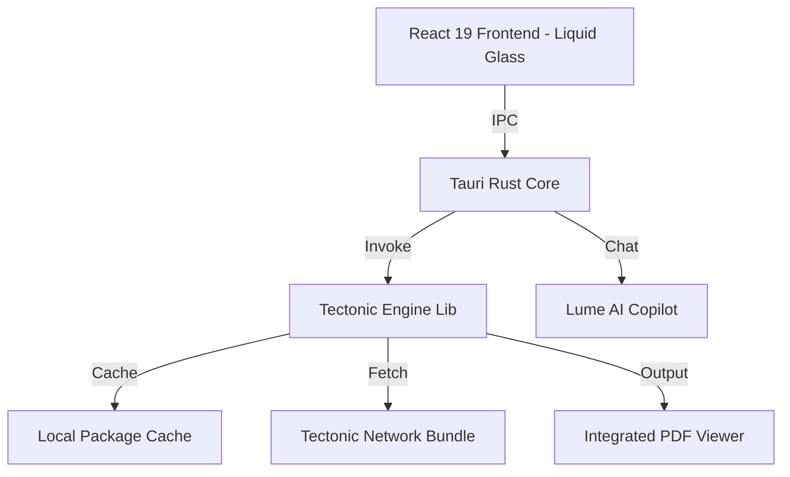

# Project Lume: 零配置 AI 驅動 LaTeX 整合開發環境

> **Status**: Design Phase | **Core**: Rust (Tauri / Tectonic) | **UX**: Liquid Glass (React)

## 1. 專案願景

**Lume** (意為光、啟發) 是一個旨在徹底終結 LaTeX 環境配置噩夢的桌面應用。它將強大的 AI 寫作助手、極簡的 UI 設計與自動化依賴管理的編譯引擎深度整合，讓研究人員與學生能專注於內容創作，而非環境排除。

### 1.1 核心痛點解決

- **環境爆炸**: 整合 Tectonic 引擎，實現「編譯即下載」，無需預裝數 GB 的 TeX Live。
- **配置複雜**: 零配置支持中文字體與常見宏包。
- **寫作門檻**: 內建 Lume Copilot (AI 寫作助手)，自動生成表格、公式與計畫書架構。
- **預覽滯後**: 基於 Rust 的高效編譯實現毫秒級實時預覽更新。

---

## 2. 命名清單 (Name Ideas)

1. **Lume** (推薦): 簡潔、具有啟發感，象徵照亮繁瑣的代碼。

---

## 3. 技術架構



### 3.1 核心組件

- **UI 層**: Vite + React 19 + Tailwind 4 (極端現代的液態玻璃美學設計)。
- **核心控制層**: Tauri (提供安全的文件系統訪問與本地二進位執行)。
- **編譯引擎**: **Tectonic (Rust Native)**。這是一個基於 XeTeX 但完全重寫了 I/O 層的引擎。
- **PDF 引擎**: 基於 WebWorker 的 PDF.js，實現與編輯器的並排預覽。

---

## 4. 關鍵功能設計

### 4.1 智能依賴感應 (Smart Dependency)

當用戶輸入 `\usepackage{amsmath}` 時，Lume 的 Tectonic 核心會自動檢查本地 Cache，若無則從雲端靜默下載，用戶完全感知不到「缺少套件」的報錯。

### 4.2 Lume AI Copilot (AI 寫作協作者)

- **Command Palette**: `CMD+K` 即可輸入「幫我寫一個三行兩列的 ESG 數據表」，AI 直接生成符合 LaTeX 語法的代碼。
- **自動標註**: AI 自動根據上下文生成交叉引用 (`\ref`) 與參考文獻 (`\cite`) 建議。

### 4.3 跨平台封裝

- **一鍵式安裝包 (.dmg / .exe)**：內建所有必要的運行時庫，真正做到開箱即用。

---

## 5. 實作路徑 (Roadmap)

### 第一階段：編譯原型 (The Forge)

- [ ] 搭建 Tauri + Tectonic Rust 整合原型。
- [ ] 實現基本的「Hello World」PDF 編譯與顯示。

### 第二階段：極簡編輯器 (The Canvas)

- [ ] 整合 CodeMirror 6 作為 LaTeX 編輯器核心。
- [ ] 實現「並排預覽 (Side-by-Side Preview)」。

### 第三階段：AI 注入 (The Soul)

- [ ] 內建多模型 API 支撐架構：
  - **OpenAI**: GPT-4o 及其系列。
  - **Anthropic**: Claude 3.5 Sonnet 等。
  - **Google**: Gemini 1.5 Pro / Flash。
  - **Local**: Ollama (適用於離線或隱私敏感數據)。
- [ ] 實作領域模板（如計畫書、論文範本）一鍵生成功能。

---

## 6. 使用場景範例

```latex
% 在 Lume 中，你只需要寫，不需要管字體
\documentclass{ctexart}
\begin{document}
你好，這是 Lume 時代的開始。
\end{document}
```

*這在 Lume 中會自動完成字體映射，無需任何環境設定。*
